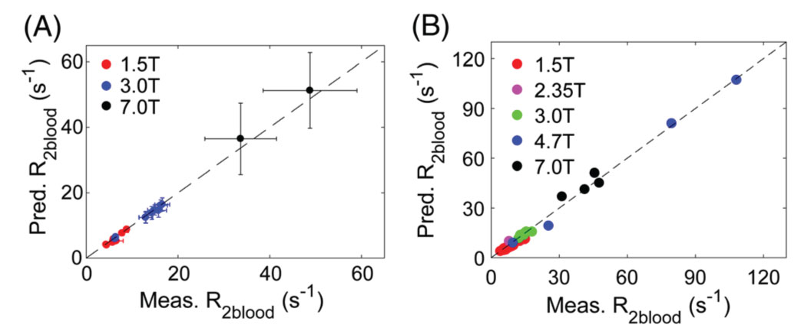

# Blood R2, R1, Hct, and Oxygenation Calculator
This repository provides relevant codes for blood R2, R1, Hct, and oxygenation calculation. An online calculator can be found [here](https://godzilla.kennedykrieger.org/cgi-bin//bloodT2T1_cal.pl) .

## Introduction
For the physiological parameter quantification, it is sometimes necessary to know the blood water R2, R1, hematocrit (Hct) and oxygenation saturation fraction (Y). We have established theoretical models that can correctly predict blood water R1 and R2 for MRI field strengths ranging from 1.5 Tesla to 11.7 Tesla, when the Hct and Y are provided (see Figure below). For R2 it is also needed to put in the MRI parameters used for the spin echo acquisition, because R2 depends on the type of echo experiment used. Alternatively, when R2 and R1 are measured, Y and Hct can be determined respectively using the calculator. Y can then be used to calculate oxygen extraction fraction (OEF) for the tissue involved.

   

Comparison of predicted CPMG-based R2blood values with literature values for in vivo human data (A) and in vitro human and bovine blood data (B).

## Reference
* Li W, Grgac K, Huang A, Yadav N, Qin Q, van Zijl PC. [Quantitative theory for the longitudinal relaxation time of blood water.](https://onlinelibrary.wiley.com/doi/full/10.1002/mrm.25875) Magn Reson Med. 2016 Jul;76(1):270-81.
* Li W, van Zijl PCM. [Quantitative theory for the transverse relaxation time of blood water.](https://analyticalsciencejournals.onlinelibrary.wiley.com/doi/full/10.1002/nbm.4207) NMR in Biomedicine. 2020;33:e4207. Erratum: NMR in Biomedicine. 2020;33:e4329.
* Lu H, Xu F, Grgac K, Liu P, Qin Q, van Zijl P. [Calibration and validation of TRUST MRI for the estimation of cerebral blood oxygenation.](https://onlinelibrary.wiley.com/doi/full/10.1002/mrm.22970) Magn Reson Med. 2012 Jan;67(1):42-9.
* Li W, Liu P, Lu H, Strouse JJ, van Zijl PCM, Qin Q. [Fast measurement of blood T1 in the human carotid artery at 3T: Accuracy, precision, and reproducibility.](https://onlinelibrary.wiley.com/doi/full/10.1002/mrm.26325) Magn Reson Med. 2017 Jun;77(6):2296-2302.

## Grant support
This work was supported by NIH grants P41 EB015909 and P41 EB031771.